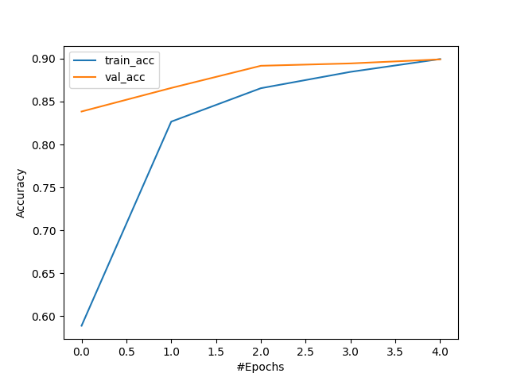
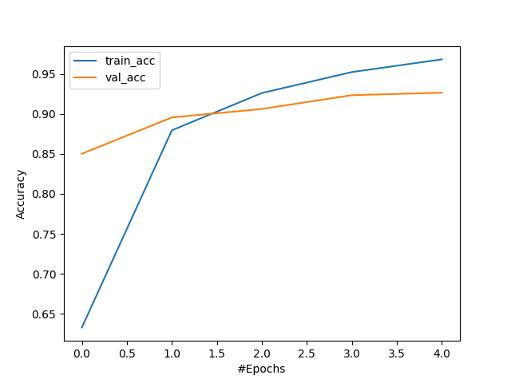
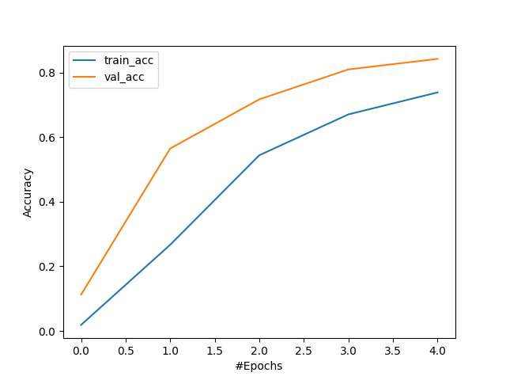

# Birds Species Classification
- It is a practice project. The dataset is available at: [kaggle](https://www.kaggle.com/datasets/gpiosenka/100-bird-species).
- These are the libraries used for this project:
  - Python 3.10.9
  - Torch 2.0.0+cu117
  - Torchvision 0.15.1
  - Pillow 9.5.0
  - Scikit-learn 1.2.2
  - Pandas 2.0.0
  - Numpy 1.24.2
  - Matplotlib 3.7.1
- I have implemented support for following models:
  - Resnet18
  - Resnet50
  - Efficientnetv2 (m)
- Following optimizers are supported:
  - SGD
  - Adam
- Here is an example CLI command to train the model:
poetry run python birds_species_classification/main.py -t \<path to train folder> -v \<path to validation folder> -te <path to test folder> -c \<path to birds.csv file> -n resnet18 -m birds_species_classification/saved_models -o adam -p birds_species_classification/save_plots -e 5

- Training vs Validation accuracy for Resnet18 with Adam opitmizer

- Training vs Validation accuracy for Resnet50 with Adam opitmizer

- Training vs Validation accuracy for Efficientnet V2 (m) with Adam opitmizer
